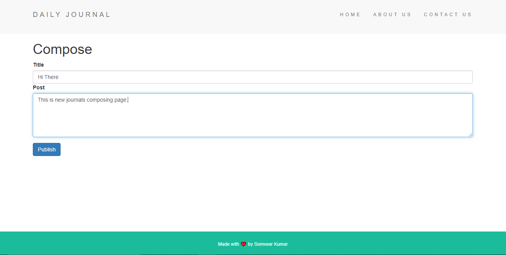

# Daily Journal Blog V2

It is a second version of journaling web app that I created during Angela Yu's "Web Development Bootcamp" which also allows saving journals to local MongoDB Database.

## Frameworks Used :-

✨ Express
✨ EJS
✨ Body Parser
✨ Lodash
✨ Mongoose
✨ MongoDB

## Daily Journal Preview

#### Home Page

#### Compose New Journals Page

