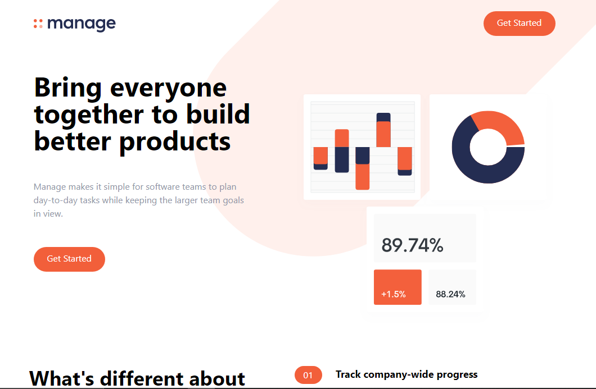

<a name="readme-top"></a>

# manage: A landing page using tailwindCss
It is a simple landing page of a company called manage.

### [Page is Live Here...](https://somveerkr.github.io/manage-landingPage/)

## Preview


<!-- GETTING STARTED -->
## Getting Started

Instructions on setting up and running this project locally.

### Prerequisites

To get started with this project, a code editor, git & node.js.
* Download and install git from [here...](https://git-scm.com/)
* Download and install node.js from [here...](https://nodejs.org/en)

### Installation

_Below is an example of how you can instruct your audience on installing and setting up your app. This template doesn't rely on any external dependencies or services._

1. Clone the repo
   ```sh
   git clone https://github.com/SomveerKr/summize-ai-article-summarizer.git
   ```
2. Install all NPM packages or dependencies
   ```sh
   npm install
   ```
3. Open index.html file in browser

## Built With
1. HTML
2. TailwindCSS


## Contributing
If you want to contribute to this project, you can fork the repository, make changes, and create a pull request.

## License
This project is licensed under the MIT License.

<p align="right">(<a href="#readme-top">back to top</a>)</p>

