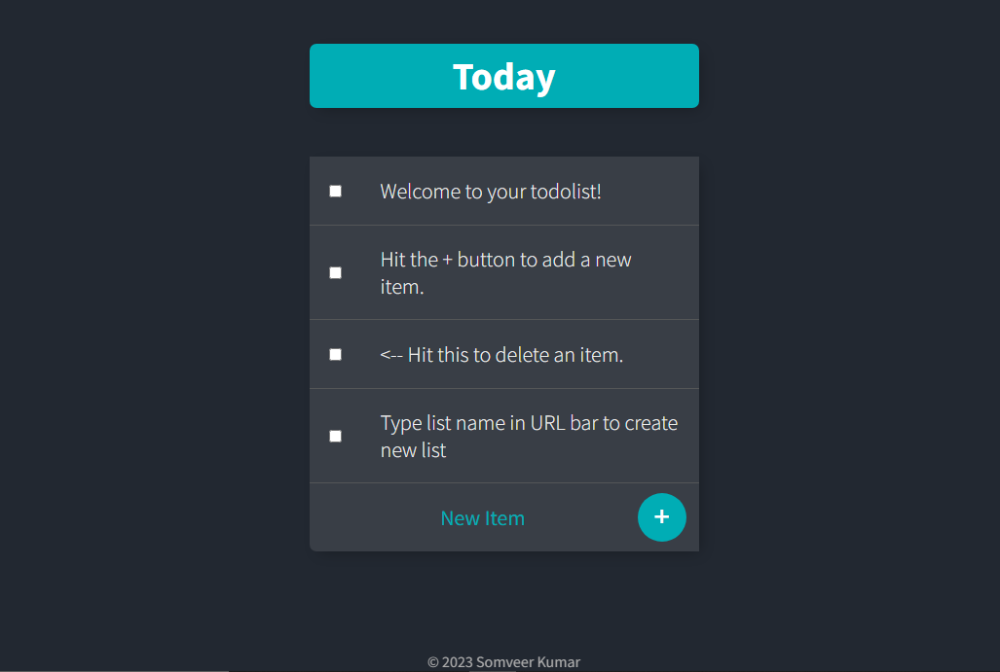

# ToDo List 
It is a todo list web app that I created during Angela Yu's "Web Development Bootcamp" which also saves todo lists to local MongoDB Database.

## Frameworks Used :-
✨ Express
✨ EJS
✨ Body Parser
✨ Lodash
✨ Mongoose
✨ MongoDB

## ToDo Lists Web App Preview
#### Today's Lists

#### Work's Lists

